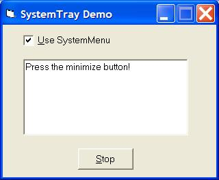



## SystemTray Class

### Description

Updated with ReceivedData event and add a demo for receiving data while the app is on the systemtray.

Start DemoReceive and DemoSend, place the Receive app on the systemtray and send a message with the Send app.

This class module will help you to put your app on the systemtray on the right way.

Events supported:

- BalloonClick()

- BalloonClose()

- BalloonHide()

- BalloonShow()

- BalloonTimeOut()

- Click (Button As Integer)

- DblClick (Button As Integer)

- Mouse Down (Button As Integer)

- Mouse Move ()

- Mouse Up (Button As Integer)

- ReceivedData(Data As String)

Read the txt file for more info.
 
### More Info
 

             |
---                |---
**Submitted On**   |2010-12-06 06:00:00
**By**             |[Ben Vonk](https://github.com/Planet-Source-Code/PSCIndex/blob/master/ByAuthor/ben-vonk.md)
**Level**          |Advanced
**User Rating**    |5.0 (50 globes from 10 users)
**Compatibility**  |VB 5\.0, VB 6\.0
**Category**       |[Custom Controls/ Forms/  Menus](https://github.com/Planet-Source-Code/PSCIndex/blob/master/ByCategory/custom-controls-forms-menus__1-4.md)
**World**          |[Visual Basic](https://github.com/Planet-Source-Code/PSCIndex/blob/master/ByWorld/visual-basic.md)
**Archive File**   |[SystemTray2194101262010\.zip](https://github.com/Planet-Source-Code/ben-vonk-systemtray-class__1-73462/archive/master.zip)

